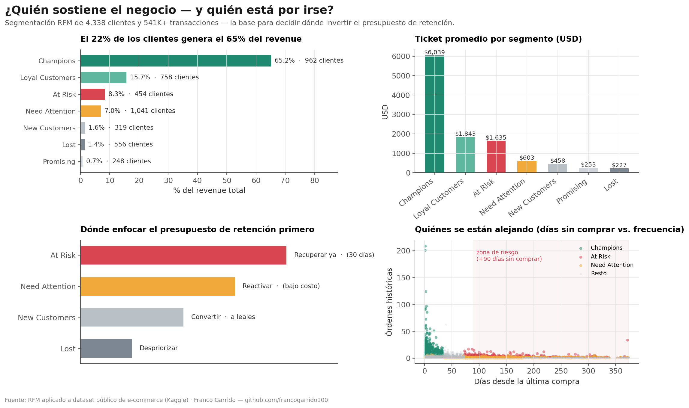

# Segmentación de Clientes (RFM) — ¿A quién protejo y a quién recupero primero?

> **El 22% de los clientes genera el 65% del revenue — y 454 de los compradores más valiosos llevan ~142 días sin volver a comprar.** Esta segmentación identifica exactamente quiénes son, y en qué orden actuar antes de perderlos.

---

## El problema de negocio

Una empresa de e-commerce con 4,338 clientes activos y 541K+ transacciones en 12 meses no tenía forma de responder preguntas básicas para planificar retención: ¿en quién conviene invertir el presupuesto de marketing esta semana? ¿quién está a punto de irse? ¿a quién ya no vale la pena perseguir?

Apliqué el modelo **RFM (Recency, Frequency, Monetary)** para convertir esa masa de transacciones en 7 segmentos accionables, y prioricé qué hacer con cada uno.

---

## Dashboard



*Cada panel responde una decisión concreta: dónde está concentrado el revenue, cuánto vale cada segmento, dónde enfocar el presupuesto de retención primero, y quién se está alejando.*

---

## Hallazgos clave

**1. La base de clientes es altamente concentrada — y eso es una vulnerabilidad, no solo una buena noticia**

| Segmento | Clientes | % del Revenue | Ticket promedio |
|---|---|---|---|
| Champions | 962 | 65.2% | $6,039 |
| Loyal Customers | 758 | 15.7% | $1,843 |
| At Risk | 454 | 8.3% | $1,635 |
| Need Attention | 1,041 | 7.0% | $603 |
| New Customers | 319 | 1.6% | $458 |
| Lost | 556 | 1.4% | $227 |
| Promising | 248 | 0.7% | $253 |

Perder una fracción de los Champions golpearía el negocio de forma desproporcionada frente a su tamaño relativo (22% de la base).

**2. "At Risk" es la prioridad número uno — no "Lost"**

454 clientes de alto valor (ticket promedio $1,635) llevan ~142 días sin comprar. Fueron compradores fuertes; todavía están a tiempo de ser recuperados con una campaña de win-back dirigida — a diferencia de "Lost" (280 días de inactividad promedio), donde el costo de reactivación probablemente supera el retorno.

**3. "Need Attention" es la oportunidad de bajo costo más grande**

Es el segmento más numeroso (1,041 clientes) pero solo aporta 7% del revenue. Compraron antes, pero su actividad cae (118 días de recencia promedio, apenas 1.7 órdenes). Una secuencia de reactivación por email de bajo costo puede destrabar este volumen.

---

## Recomendaciones priorizadas

| # | Acción | Por qué primero |
|---|---|---|
| 1 | Programa de fidelización y beneficios exclusivos para Champions | Protege al 22% de clientes que sostiene dos tercios del negocio |
| 2 | Campaña de recuperación dirigida a "At Risk" dentro de 30 días | Última ventana realista antes de que pasen a "Lost" de forma permanente |
| 3 | Secuencia de reactivación de bajo costo para "Need Attention" | Mayor volumen de clientes a menor costo de conversión |
| 4 | Onboarding para convertir "New Customers" en leales | Define si el negocio crece o solo repone bajas |
| 5 | Despriorizar "Lost" | El costo de reactivación supera el retorno esperado |

---

## Cómo se construyó

- Cálculo de Recency, Frequency y Monetary por cliente sobre 12 meses de transacciones
- Scoring 1–5 por dimensión y combinación en 7 segmentos estándar de la industria
- Resumen por segmento (tamaño, revenue, ticket promedio) para soportar la priorización

**Stack:** Python · Pandas · Matplotlib · Seaborn · Excel

---

## Estructura del repositorio

```
rfm_customer_segmentation/
│
├── rfm_analysis.ipynb     # Notebook completo (cálculo RFM + segmentación + visualizaciones)
├── rfm_results.xlsx       # Scores RFM por cliente y resumen por segmento
├── rfm_dashboard.png      # Dashboard de segmentación
└── ReadMe.md
```

Dataset: [E-commerce Data (Kaggle)](https://www.kaggle.com/datasets/carrie1/ecommerce-data)

📓 [Ver notebook completo](https://francogarrido100.github.io/RFM-Customer-Segmentation/rfm_analysis.html) (si no se visualiza el .ipynb en GitHub)

---

## Autor

Franco Garrido — Economista especializado en analítica de negocio · [GitHub](https://github.com/francogarrido100) · [LinkedIn](https://www.linkedin.com/in/franco-garrido) · [Upwork](https://www.upwork.com/freelancers/~01464eeecfaee2a8a5)
